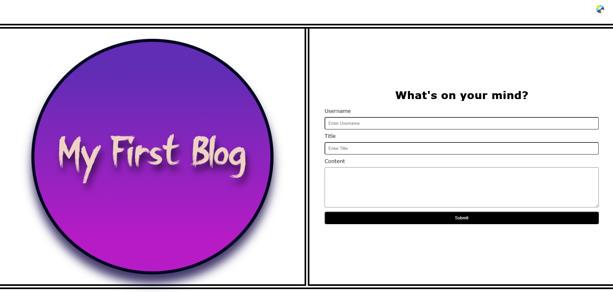
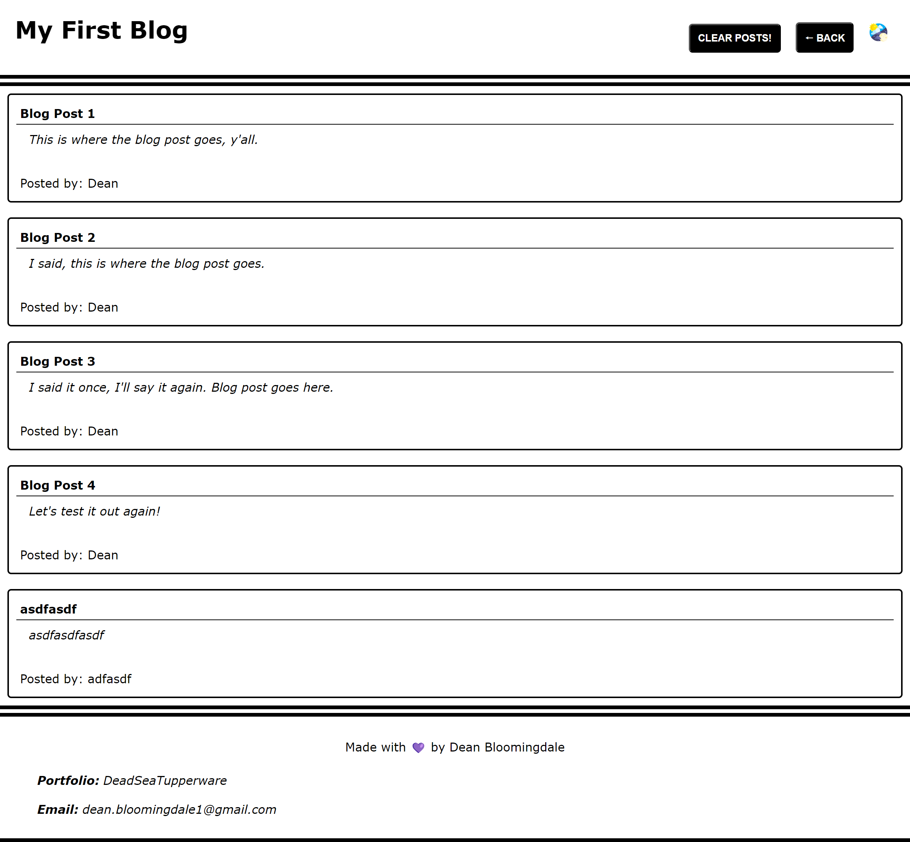

# Web API Challenge: Personal Blog

## Description

The goal of this project was to create and deploy a webpage, written from scrath with HTML, CSS, and JavaScript, to act as a personal blog for a marketing student, complete with posting capability.

## Completed Tasks

- [x] Constructed Landing Page for blog.
    - [x] Landing page contains form with labels and inputs for username, blog title, and blog content
    - [x] When form is submitted correctly, data is stored in localStorage, and user is brought to blog display page.
    - [x] When form is submitted incorrectly, user will be prompted with error message prompting completion of the form.
- [x] Constructed secondary page to display blog posts after submission.
    - [x] Posts page contains header with light mode/dark mode toggle button, and a "Back" button that redirects to landing page.
    - [x] Light mode/dark mode toggle button has full functionality when clicked.
    - [x] Main content section displays stylized list of blog posts, pulled from JSON arry of blog post objects from localStorage.
    - [x] Each blog post object contains post author's username, title of the post, and post content.
    - [x] Footer links to developer portfolio and email.

## Screenshots

'''

'''
## Deployed Application

[https://deadseatupperware.github.io/Homework4-Personal-Blog/](https://deadseatupperware.github.io/Homework4-Personal-Blog/)

[Github Repository](https://github.com/DeadSeaTupperware/Homework4-Personal-Blog/)
